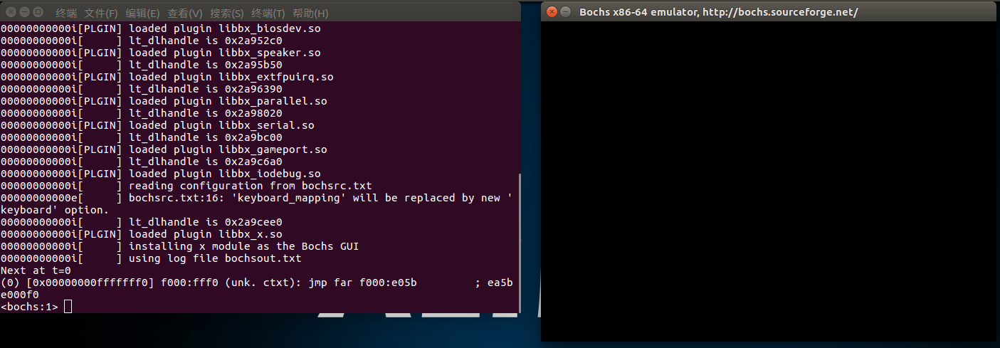
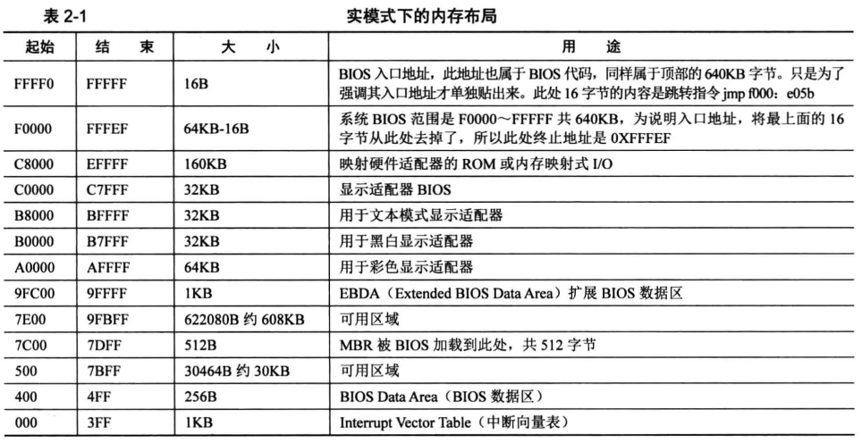
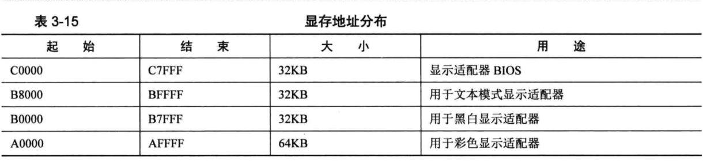
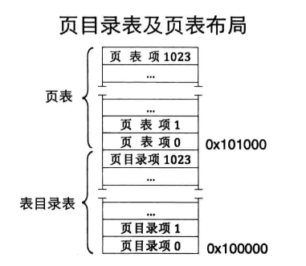
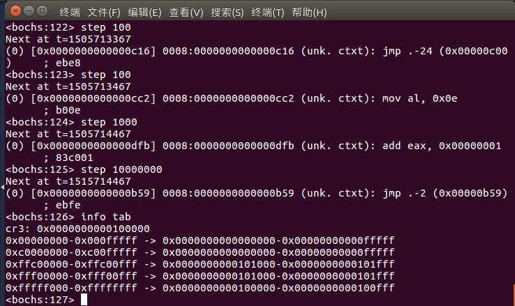

# HorizonOS开发文档
- [HorizonOS开发文档](#horizonos开发文档)
  - [项目说明](#项目说明)
  - [开发环境](#开发环境)
    - [Ubuntu安装](#ubuntu安装)
    - [GCC编译器安装](#gcc编译器安装)
    - [NASM编译器安装](#nasm编译器安装)
    - [bochs安装和配置](#bochs安装和配置)
      - [bochs安装](#bochs安装)
      - [bochs配置](#bochs配置)
    - [配置SFTP](#配置sftp)
  - [操作系统的架构和工作流程](#操作系统的架构和工作流程)
    - [bootloader](#bootloader)
      - [MBR](#mbr)
        - [初始化内存](#初始化内存)
        - [读硬盘数据](#读硬盘数据)
        - [操作显卡显示](#操作显卡显示)
      - [loader](#loader)
        - [进入保护模式](#进入保护模式)
        - [内存分页](#内存分页)
          - [创建页表](#创建页表)
          - [使能页表](#使能页表)
    - [kernel](#kernel)

## 项目说明
<p>本项目从零开始构建一个操作系统。
<p>本文档详细说明开发思路和具体操作。

## 开发环境
1. Ubuntu + GCC编译器 + NASM编译器 + bochs
2. Windows10 + VS Code
### Ubuntu安装
见 https://blog.csdn.net/Python_0011/article/details/131633534
### GCC编译器安装
在Linux终端执行sudo apt install build-essential
### NASM编译器安装
在Linux终端执行sudo apt-get install nasm
### bochs安装和配置
#### bochs安装
在Linux终端执行sudo apt install bochs
#### bochs配置
1. 创建bochsrc.txt

内容如下：
````
# RAM size
megs: 32
# Change to your Bochs installation path
romimage: file=/usr/share/bochs/BIOS-bochs-latest
vgaromimage: file=/usr/share/bochs/VGABIOS-lgpl-latest

# Disk
boot: disk
ata0: enabled=1, ioaddr1=0x01f0, ioaddr2=0x03f0, irq=14
ata0-master: type=disk, path="scroll.img", mode=flat, cylinders=6, heads=16, spt=63

log: bochsout.txt

mouse: enabled=0
keyboard_mapping: enabled=1, map=/usr/share/bochs/keymaps/x11-pc-us.map
clock: sync=realtime
cpu: ips=1000000
````
其中，``romimage: file=/usr/share/bochs/BIOS-bochs-latest
vgaromimage: file=/usr/share/bochs/VGABIOS-lgpl-latest``根据自己bochs的安装位置进行修改，``path="scroll.img``就是镜像文件，可自行命名，创建的镜像文件需要和``bochsrc.txt``在同一路径，其他参数可不修改。

2. 创建配置文件

应用命令行工具``bximage``构建配置文件。命令如下：
````
>> bximage
========================================================================
                                bximage
                  Disk Image Creation Tool for Bochs
          $Id: bximage.c 11315 2012-08-05 18:13:38Z vruppert $
========================================================================

Do you want to create a floppy disk image or a hard disk image?
Please type hd or fd. [hd] hd

What kind of image should I create?
Please type flat, sparse or growing. [flat] flat

Enter the hard disk size in megabytes, between 1 and 8257535
[10] 1

I will create a 'flat' hard disk image with
  cyl=2
  heads=16
  sectors per track=63
  total sectors=2016
  total size=0.98 megabytes

What should I name the image?
[c.img] test

Writing: [] Done.

I wrote 1032192 bytes to test.

The following line should appear in your bochsrc:
  ata0-master: type=disk, path="test", mode=flat, cylinders=2, heads=16, spt=63
````
其中一般需要修改``Enter the hard disk size in megabytes, between 1 and 8257535``后的大小，这是要构建的硬盘大小。文件名称需要与第一步构建的``bochsrc.txt``中的文件名称一致。

3. 运行Bochs进行测试

输入命令
````
bochs -f bochsrc.txt
````

<p>进入该界面表示默认进入调试模式，输入c即可正常运行。弹窗提示``No bootable device``为正常现象，表示配置成功。

### 配置SFTP
见 https://blog.csdn.net/iamlujingtao/article/details/102501845
## 操作系统的架构和工作流程
### bootloader
<p>操作系统在工作时，首先需要将操作系统本身载入内存，这一般通过一段额外的引导程序来完成，这段引导程序就是bootloader。在硬件电路上电的初期，可以运行的只有已经被固定存放在某一个存储单元中的程序，这段程序在CPU上电时被默认搬运到某个地址，然后运行，这由程序运行依赖的硬件载体决定。这段程序就是bootloader，作用就是初始化内核运行所必须的硬件外设，例如内存，flash，以太网等，然后把内核搬运到内存中。

<p>对于X86系列的CPU而言，在初始上电时可以访问1MB的内存空间，这1MB的空间就是所谓的实模式下的内存，如下图所示。至于为什么实模式只有1MB，这和X86的地址总线宽度有关。事实上，在这1MB中，低640KB地址指向的是DRAM，高64KB地址指向的是ROM，至于为什么这么指，和实际芯片引脚连接的设备有关。事实上，这只是对于8086而言，对于其他芯片，可能会有其他的定义，但不同的芯片地址空间不同，操作这些芯片的方法都是一致的。


#### MBR
<p>如果有过单片机的基础，实际上bootloader就是一段单片机裸机的代码。对于X86而言，采用了两级boot的形式，即先运行一个更简单的bootloader来驱动一个复杂的bootloader，再由更复杂的bootloader来驱动内核，这样的boot方式在嵌入式系统或者计算机中都是常见的，因为可以极大减少始终存放在flash或者rom中的计算机程序，把bootloader的一大部分也可以存放在硬盘中。一般会把最初始的那一段bootloader称为一级boot，然后依次类推二级boot，三级boot等。对于X86系统，MBR就是他的一级boot的别称。
<p>对于X86系统，规定了MBR的大小必须是512字节，CPU规定了MBR运行的起始地址为0x7C00。MBR的作用是初始化内存，将二级boot从硬盘读入内存，然后跳转到二级boot。为了方便调试，我们可以在MBR中加入操作显卡的代码，从而通过屏幕打印调试信息来判断程序是否正确执行。至于MBR如何被搬入内存，这是由计算机主板的BIOS程序完成的。BIOS在自检通过后，将MBR扇区整个读到内存中，然后跳转执行MBR。所以如果把BIOS也看做boot的一部分，那么MBR是二级boot，后面的bootloader是三级boot。

##### 初始化内存
<p>汇编语言允许我们直接操作相关寄存器。以32位CPU为例，包括段寄存器、数据寄存器和变址寄存器等。CS为代码段寄存器，在CPU工作时会将内存分为代码段、数据段、堆栈段等，段寄存器中存放了相关的段基址。在MBR代码中，此时的段地址是0xf000，这个值就是CPU上电时BIOS代码所在的段地址。一个段内包含的地址空间为0x0000-0xffff。

````
mov ax, cs
mov ds, ax
mov es, ax
mov ss, ax
mov fs, ax
````
以上代码很好理解，就是读当前的段地址，然后分别定义数据段、堆栈段的段地址。MBR程序只能运行在初始的1MB空间内，因此段地址都是0xf000。之后是定义偏移地址
````
mov bx, sp
mov ax, [bx]
mov [0x7c00], ax
````
这是在保存现场，我们希望初始化内存到偏移地址为0x7c00的位置处，因此把当前程序运行地址内的数据先搬移到0x7c00地址处。
````
mov sp, 0x7c00
````
这里直接赋值sp指针，将当前偏移地址设置为0x7c00。所以初始化内存，就是设置程序运行的段地址和偏移地址。
##### 读硬盘数据
汇编语言可以实现对硬盘数据的读写，具体步骤如下：
1. 备份eax和cx数据
````
mov esi,eax
mov di,cx
````
在读硬盘数据之前，我们将待读硬盘的起始扇区所在地址存入eax，将待读扇区数目存入cx，然后分别复制给esi和di做备份。
2. 设置要读取的扇区数
````
mov dx, 0x01f2
mov al,cl
; out为写入指令，将al中的值写入端口0x01f2，这个端口应该是硬盘所在的地址
out dx, al
; 恢复eax
mov eax, esi
````
0x01f2是硬盘控制器的端口寄存器地址
3. 将LBA地址存入0x1f3-0x1f6
LBA就是硬盘的逻辑块地址
````
mov dx, 0x1f3
out dx, al    ;al已经存入磁盘数目
; LBA地址15-8位写入端口0x1f4
; shr表示逻辑右移（shift right，SHR），目的操作数中的每一位右移，原操作数决定移位的数目
mov cl, 8
shr eax, cl
mov dx, 0x1f4
out dx, al
; LBA地址23-16位写入端口0x1f5
shr eax, cl
mov dx, 0x1f5
out dx, al
; LBA地址第24-27位
shr eax, cl
and al,0x0f
; 设置7-4位为1110，表示lba模式
or al,0xe0
mov dx, 0x1f6
out dx, al
````
操作端口寄存器需要用out指令，具体参考下面的文章https://blog.csdn.net/fjlq1994/article/details/49472827
操作端口寄存器用out指令。这里其实就是把一个很长的LBA地址分不同位写到端口寄存器里面，移位写入的循环。
4. 向0x1f7端口写入读命令，0x20
````
mov dx, 0x1f7
mov al, 0x20
out dx, al
````
5. 检测硬盘状态
````
.not_ready:
    nop
    ; in为输入指令，表示从dx地址端口读取数据到al，此时dx存放的是磁盘端口0x1f7
    in al, dx
    and al, 0x88
    ; cmp从目的操作数减去源操作数，不修改任何操作数，根据逻辑置位ZF和CF标志位
    ; jnz判断ZF标志位，若=0则跳转，否则不跳转
    ; 这里判断al是否等于0x08，不等于则循环该段
    cmp al, 0x08
    jnz .not_ready
````
这里有个循环，in指令读端口寄存器，判断标志位，否则循环。
6. 从0x1f0读数据
````
; di为要读取的扇区数，一个扇区有512个字节，每次读入两个字节，所以di * 256
    mov ax, di
    mov dx, 256
    ; mul为乘操作，与ax寄存器相乘，结果在ax中
    mul dx
    mov cx, ax
    mov dx, 0x1f0
.go_on_read:
    in ax, dx
    mov [bx], ax
    add bx, 2
    loop .go_on_read
    ret
````
cx是循环次数，循环读256次读取一个扇区，总循环次数为256 * di。
##### 操作显卡显示
8086显存的地址分布如下：

向显示适配器对应的地址写入ASCII码字符即可操作显卡实现显示，代码如下：
````
print_segments:
    ; 0xb800为显存文本模式的内存地址。
    mov ax, 0xb800
    ; 将gs作为显存段地址
    mov gs, ax
    ; 利用0x06号功能，上卷全部行则可清屏
    ; 配置各寄存器
    ; AH 功能号 = 0x06
    ; AL 上卷的行数（为0则表示全部）
    ; BH 上卷的行属性
    ; (CL, CH) 窗口左上角的(X, Y)位置
    ; (DL, DH) 窗口右下角的(X, Y)位置
    mov ax, 0600h
    mov bx, 0700h
    ; 左上角(0, 0)位置
    mov cx, 0
    ; 右下角(80, 25)位置
    mov dx, 184fh
    ; VGA文本模式中，一行只能容纳80个字符，共25行
    int 10h
    ; 输出字符串：MBR
    ; A表示绿色背景闪烁，4表示前景色为红色
    mov byte [gs:0x00], '1'
    mov byte [gs:0x01], 0xA4
    mov byte [gs:0x02], ' '
    mov byte [gs:0x03], 0xA4
    mov byte [gs:0x04], 'M'
    mov byte [gs:0x05], 0xA4
    mov byte [gs:0x06], 'B'
    mov byte [gs:0x07], 0xA4
    mov byte [gs:0x08], 'R'
    mov byte [gs:0x09], 0xA4
````
代码中，先将gs段寄存器赋值为0xb800，选中对应的显存地址。向ax、bx、cx和dx寄存器写入值可配置光标所在位置并实现清屏功能，然后向gs段内存地址写入相应的值即可实现屏幕打印显示。
#### loader
MBR将loader代码从硬盘搬运到内存中，然后跳转到loader。
##### 进入保护模式
由MBR跳转到loader后， CPU仍然工作在实模式，首先要开启保护模式以防止产生灾难性的故障，同时扩大CPU的可用资源。与实模式相比，保护模式通过虚拟地址访问物理地址，从而使程序可操作的内存不再受到地址总线宽度的限制。8086进入保护模式需要三个步骤：打开A20，加载GDT，将cr0的pe位置1，代码如下：
````
; 进入保护模式
setup_protection_mode:
    mov ax, setup_protection_mode_message
    mov dx, 0x00
    mov cx, setup_protection_mode_message_length
    call print_message_real_mode
    ; 打开A20
    in al, 0x92
    or al, 0000_0010b
    out 0x92, al
    ; 加载gdt
    lgdt [gdt_ptr]
    ; cr0第0位置1
    mov eax, cr0
    or eax, 0x00000001
    mov cr0, eax
    ; 通过远跳刷新流水线
    jmp SELECTOR_CODE:p_mode_start
````
A20地址线是控制CPU访问高出1MB地址空间的地址时选择地址回绕还是访问真实物理内存的开关。在实模式下，A20地址线是关闭的，当CPU访问超出1MB空间的地址时会地址回绕；在保护模式下A20地址线应该被开启，因为此时不再直接访问物理地址。打开A20地址线的方法很简单，就是将端口0x92的第一位置1即可。
GDT是用来记录段描述符的表。在保护模式下，段寄存器中记录了GDT中的某一个描述符的索引，描述符中记录了段基址、段界限和段属性，通过GDT再映射到实际的物理地址。
控制器寄存器CR0的第0位是保护模式的开关，置1则开启保护模式。
通过远跳刷新流水线。当开启保护模式后，段描述符缓冲寄存器并不会更新，仍为实模式下的值。且此时当前代码运行在保护模式，而上一行代码运行才实模式，导致流水线工作异常。当CPU执行jmp指令时，会清空已经送上流水线的指令，且会改变段寄存器的值，因此远跳可以解决上述两个问题。
##### 内存分页
通过建立页表来实现内存分页。为减小页表本身占用内存的空间，建立二级页表实现内存分页。无论是几级页表，标准页的尺寸都是4KB，每一个页表中含1024项，因此一个页表可管理4MB的内存空间。没一个页目录表含1024项，因此可管理1024个页表，则可管理4GB的地址空间。
因此，二级页表将32位虚拟地址区分为高10位，中间10位和低12位，高10位为页表的索引，可定位页目录表中的一个页目录项PDE，PDE中存储了页表的物理地址。中间10为作为物理页的索引，用于定位页表项PTE，页表项中存储了物理页地址，可找到要访问的物理页物理地址。低12位则可访问一个物理页内包含的4K地址空间。
页表实际上就是一段连续的物理空间，其中存储了PDE或PTE，每一个PDE或PTE中存储的物理空间仅需要20位，因此低12位用于记录页表的读取属性。
###### 创建页表
```
setup_page:
    push PAGE_SIZE
    push PAGE_DIR_TABLE_ADDR
    call clear_memory
    add esp, 8
    ; 创建 pde
    .create_pde:
        ; 在内存中，每一个 pde/pte 为 4B 。物理空间共 4G ，每一个 pte 指向 4K 的物理地址，因此需要 1M 个 pte 。
        ; 这 1M 个 pte 可以直接放在一张页表中，或者拆分为 1K 个页表，每个页表存放 1K 个页表项。
        ; 每个 pde 指向一个页表，因此使用二级页表的话共有 1K 个 pde。
        ; 在内存中，页目录表和页表的布局是直接连续存放的，先存放页目录表，再存放页表（页目录表为低地址，页表为高地址）。
        ; 此时 eax 存放的是页目录表的物理地址
        mov eax, PAGE_DIR_PHYISCAL_ADDR
        or eax, PG_US_U | PG_RW_W | PG_P
        ; 将第一个 pde 存放在页目录表的首地址
        mov [PAGE_DIR_TABLE_ADDR + 0], eax
        ; 将页目录表的第 0 项和第 768 项都指向同一个页表，这是因为操作系统会放在 3GB-4GB 的虚拟空间内。
        mov [PAGE_DIR_TABLE_ADDR + 768 * 4], eax
        ; 最后一个页目录项指向页目录表自己的地址
        sub eax, 0x1000
        mov [PAGE_DIR_TABLE_ADDR + 4092], eax

        ; 创建操作系统的其他 pde （虚拟地址中的 3GB-4GB 的虚拟空间）
        mov eax, PAGE_DIR_TABLE_ADDR + PAGE_SIZE
        or eax, PG_US_U | PG_RW_W | PG_P

        ; ecx 中存储了循环次数（第一个地址已经写入值了）
        mov eax, PAGE_DIR_PHYISCAL_ADDR
        add eax, 0x2000
        mov ecx, 254
        mov edx, PAGE_DIR_TABLE_ADDR + 769 * 4
        ; 创建内核（高1GB）的页目录表
        .create_kernel_pde:
            mov [edx], eax
            add eax, PAGE_SIZE
            add edx, 4
            loop .create_kernel_pde
    ; 创建页表
    mov eax, 0
    or eax, PG_US_U | PG_RW_W | PG_P
    mov ecx, 256
    mov edx, PAGE_DIR_PHYISCAL_ADDR
    .create_pte:
        mov [edx], eax
        add eax, PAGE_SIZE
        add edx, 4
        loop .create_pte
    ret
```
创建页表，就是在一段连续的内存中写入PDE或PTE。页目录表的第0项和第768项需要指向同一个地址，因为高1GB的地址空间是系统空间，低3GB的地址空间是用户空间，这样可以保证每一个用户进程在访问高1GB的地址空间时访问相同的物理地址。同时操作系统内核放在低端1MB的物理空间，但虚拟地址是高3GB地址空间，因此需要将两个地址对应起来。页目录表放在低1M地址空间处，物理内存布局如图：

页目录表的最后一项需要指向页目录表自己的地址，这实际上也是最后一项页表的地址。
###### 使能页表
```
; 使能页表，就是将描述符的地址和偏移量写入内存 gdt_ptr，然后用新地址（虚拟地址）重新加载
; 说人话，就是给原来的 gdt 搬个家，从物理地址搬到新的物理地址（高 1GB 的空间），然后通过页表去读写
enable_page:
    ; 存储带原来 gdt 所在的位置
    sgdt [gdt_ptr]
    ; 改变 gdt 描述符中视频段描述符的位置
    mov ebx, [gdt_ptr + 2]
    or dword [ebx + 0x18 + 4], 0xC0000000

    ; move gdt to > 0xC0000000
    add dword [gdt_ptr + 2], 0xC0000000

    ; move stack to 0xC0000000
    mov eax, [esp]
    add esp, 0xc0000000
    mov [esp], eax

    ; 把页目录的地址给 cr3，这是建立页表后的第二步
    mov eax, PAGE_DIR_TABLE_ADDR
    mov cr3, eax

    ; enable paging on cr0 register，这是建立页表后的第三步
    mov eax, cr0
    or eax, 0x80000000
    mov cr0, eax

    ; load gdt again - gdt has been moved to > 0xC0000000
    lgdt [gdt_ptr]

    ; refresh video segment selector cache
    mov ax, SELECTOR_VIDEO
    mov gs, ax

    ret
```
使能页表后，可在虚拟机内查看建立的页表映射关系如下，坐便列出的是32位虚拟地址范围，右边列出的是对应的物理地址。

### kernel